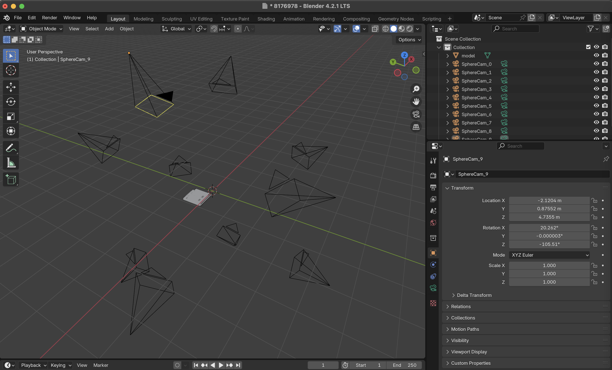
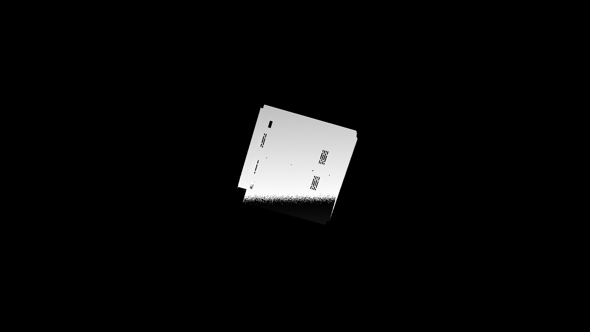

# STL to Synthetic Scans

This project converts STL files into synthetic 3D scans using Blender. It simulates a scanning process by generating synthetic depth maps and reconstructing point clouds from different camera viewpoints around the STL models.

## Overview

The pipeline takes STL models, generates multiple synthetic camera views, selects the best viewpoint automatically, and creates realistic synthetic scans.

## Workflow

1. **Scene Setup in Blender:**  
   A Blender scene is created automatically.

2. **Insert STL Model:**  
   The STL file is loaded into the Blender scene.

3. **Generate Sphere Around Object:**  
   A sphere (fixed or dynamically sized) is generated around the model to position cameras.

4. **Position Cameras:**  
   Cameras are placed evenly across the sphere's surface to capture various viewpoints of the object.
   

5. **Generate Depth Maps:**  
   Each camera generates a 1080p depth map.

6. **Best View Selection:**  
   The best view is automatically selected by maximizing the number of non-zero pixels in the depth maps. This simulates human-like optimal scanning angles, ensuring quality synthetic scans.
   

7. **Noise**
   Add noise to the depth map to simulate sensor noise.

8. **Reconstruct Point Cloud:**  
   The depth map from the best camera is converted into a 3D point cloud using the camera parameters.
   


9.  **Save Results:**  
   The synthetic scans (point clouds and depth maps) are saved to the specified output folder.

## Usage

### Step 1: Configuration

Edit the configuration in the script file:

```bash
blend_stl_to_sythetic_scan.py
```

Specify:
- Path to the input STL files
- Output folder for synthetic scans

### Step 2: Generate Synthetic Scans

Run the script:

```bash
python blend_generate_synthetic_scan.py
```

Ensure Blender is installed and accessible from the command line.

## Requirements

- **Blender** (tested with version 4.2.1 LTS)
- Python environment configured to run Blender scripts
- STL files prepared in the input folder

## Inputs

The inputs should be named following this convention : ```id_of_the_scan.stl```

```bash
blender_generate_synthetic_data/
└── input_folder/
    ├── 124027.stl         # stl filess 
    ├── 341934.stl         
    └── ...                
```

## Outputs

Generated results include:

```bash
blender_generate_synthetic_data/
└── output/
    ├── blend/             # Blender scene files (.blend)
    ├── depthmap_best/     # Depth maps from the best camera views
    ├── depthmap_median/   # Depth maps from median-quality camera views
    ├── pcd_best/          # Point clouds from the best camera views
    └── pcd_median/        # Point clouds from median-quality camera views
```
