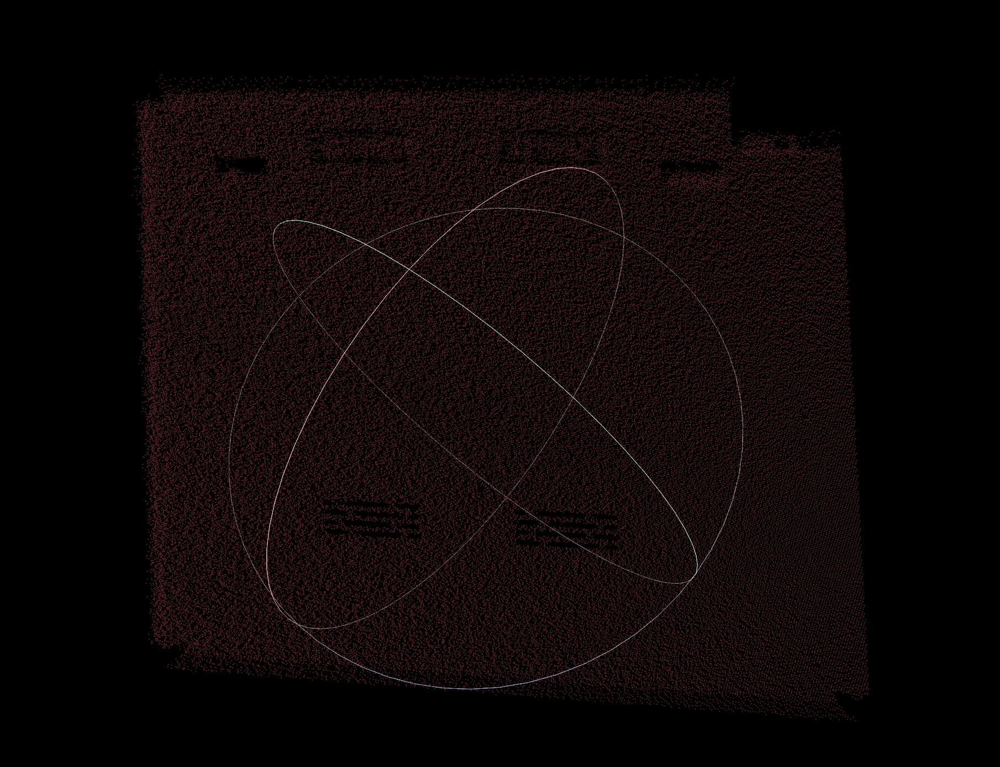

# Synthetic 3D Point‑Cloud Generation with Helios2 ToF Camera Simulation

This codebase lets you automatically generate noisy depth‑maps and back‑projected point clouds (PLY) from STL models using Blender and Open3D, simulating a Helios2 Time‑of‑Flight camera.

---

## Repository Contents
```
├── bl_helios2_synthetic.py   # Main script
├── camera_params.py          # Camera Utils       
└── config1.yaml              # Config
```

## Configuration

Edit **config1.yaml**, for example:

```yaml
stl_directory:    "data/structured_dataset/STL"
output_directory: "outputs/ply_with_noise"
number_of_cameras: 10
radius:            1.0
noise:             0.001
```

## How to use

You can simply edit the config file and then run the main script : 

```Python
python bl_helios2_synthetic.py
```

## Results

### Step 1
Insert the object and place helios camera on the sphere around it.  


### Step 2 
Generate the depth maps from different views ans keep the best one


### Step 3
Back project the depth maps in 3d space (simulating the capture from a single view)


## Acknowledgements

- Utilities in `camera_params.py` were taken from [OriginalRepo](https://blender.stackexchange.com/questions/38009/3x4-camera-matrix-from-blender-camera) by [Original Author](https://blender.stackexchange.com/users/3581/daniel), licensed under the MIT License.  Modifications and integration by Charles Beaulieu.